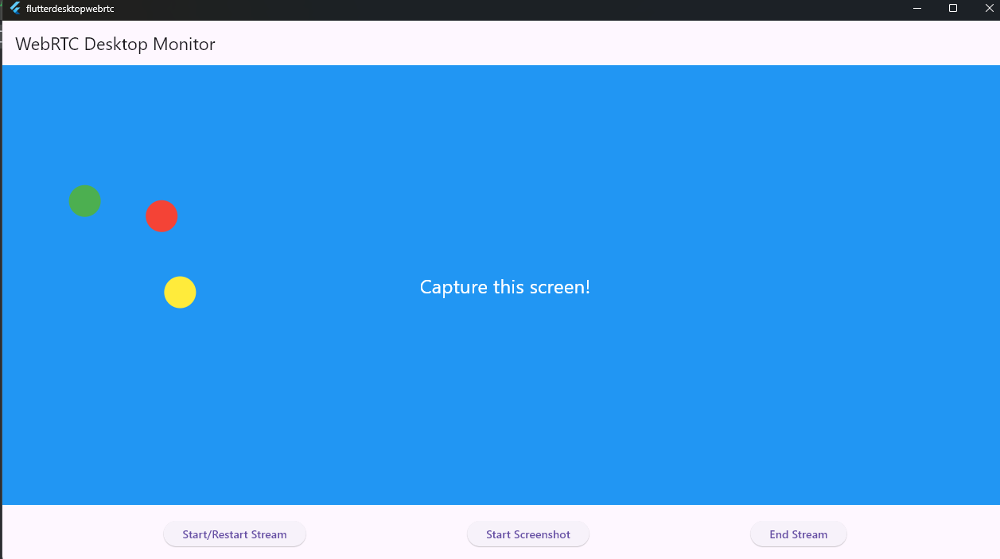

# Flutter Desktop Screenshot Capture

A Simple Flutter Desktop application powered by Flutter WebRTC to deliver real time communication between devices. Goal is to capture screenshot of the desktop app and stream to the devices(mobile) and display the images.

## How to run?
Clone and run in windows mode on Android Studio or Visual Studio Code!

